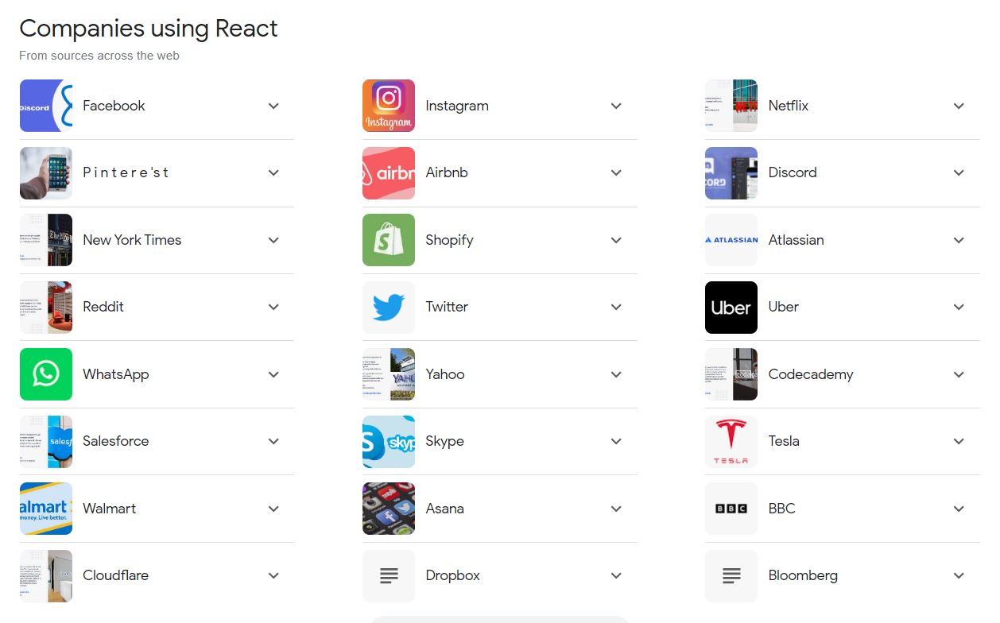

# React Js: Redefining Modern Web Applications. 

There’s too many companies using React JS to list them all here, but I will show you the main large companies using React for their applications.

Did you know that all these companies use React in their applications?

Ever wonder why top-tier companies such as Facebook, Airbnb, Instagram, and Netflix have powerful, seamless, and visually stunning websites?
The secret lies in React JS, a game-changing JavaScript library used for building user interfaces, especially for single-page applications. 

Why do these industry leaders love React? 

First off, its component-based architecture enhances code reusability, which saves a lot of development time. React JS also takes the efficiency and flexibility of websites to the next level by enabling seamless transitions without needing a page refresh. Moreover, React's unique feature called the Virtual DOM enhances a website's performance, especially when handling high volumes of data. 

Additionally, React also paves the way for mobile app development through React Native, an equally impressive framework for native mobile apps. So not only are these companies investing in a powerful tool for their websites, but they're also positioning themselves for consistent and reliable mobile presence. But React's influence isn't just limited to big businesses. Its open-source nature and robust community support make it a hit amongst independent developers and start-ups alike. 

Its popularity is continuously soaring with its flexibility to integrate with other frameworks and scalability to accommodate growth. No wonder, React JS has garnered massive popularity and has turned into an essential tool in modern web development. 

To put it succinctly, if you're not considering React JS, you might be missing out on the many wonders of efficient, responsive, and appealing web and mobile apps.

## ⚡ Learn React

You can learn more in the [Create React App documentation](https://facebook.github.io/create-react-app/docs/getting-started).

To learn React, check out the [React documentation](https://reactjs.org/).
